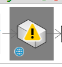
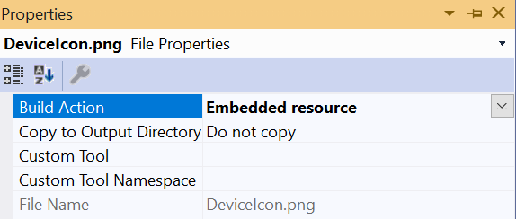

  


<P>  </P>


# Connexion DeviceIcon Troubleshooting


<P> &nbsp; </P>


Having trouble getting your Connexion Device Icon to show? 

Getting a yellow warning icon instead?

Try these helpful troubleshooting tips.


 
 <P> &nbsp; </P>
 
 
  
 <P> &nbsp; </P> 
 
 

## 1) Check DeviceFactory.cs

Look for the public property `DeviceImage`:

```C#
namespace CoolConnexionDevice
{
    public class CoolConnexionDeviceFactory : BaseDeviceFactory<CoolConnexionDeviceConfiguration>
    {
    
        ...
        
        public override BitmapImage DeviceImage
        {
            get
            {
                var image = new BitmapImage();
                image.BeginInit();
                image.StreamSource = Assembly.GetExecutingAssembly().GetManifestResourceStream($"{nameof(CoolConnexionDevice)}.DeviceIcon.png");
                image.EndInit();
                return image;
            }
        }

  }
}
```


The manifest resource name should be of the form [Namespace].DeviceIcon.png. In this case, since the namespace is CoolConnexionDevice, the you should be passing "CoolConnexionDevice..DeviceIcon.png" into `GetManifestResourceStream()`. 

I reccommend you use the nameof() keyword as shown in the example here, to prevent the icon from breaking, should the namespace be renamed in the future.


<P> &nbsp; </P> 


  <P> &nbsp; </P>


   


## 2) Ensure the icon file is included as an Embedded Resource upon build.


There is two ways to do this. You can check the properties of the project's `DeviceIcon.png` file in Visual Studio by right-clicking on it and selecting Properties. Make sure its **Build Action** is: **Embedded Resource**:




 

Or you can look inside the .csproj file. You want to make sure it contains these lines:

 
 
```xml
<ItemGroup>
<None Remove="DeviceIcon.png" />
<EmbeddedResource Include="DeviceIcon.png" />
</ItemGroup>
```


Personally, I would always double-check the .csproj file to enure the `<None Remove="DeviceIcon.png" />` node is present, and before the `EmbeddedResource` node. This could be important if MSBuild is acting really buggy or if there winds up being duplicate EmbeddedResource nodes in the .csproj file for some reason. So your best bet is to copy the above XML snippet into the .csproj file exactly like you see it above, in that order.

Ensure there is no other references to DeviceIcon in the .csproj (Except for the `<PackageIcon>DeviceIcon.png</PackageIcon>` node inside a `<PropertyGroup>`, which is for the nuget package), as this can cause problems in an inconsistant way. 


<P> &nbsp; </P> 
 
 

 <p> &nbsp; </p> 


   
   


## 3) Make sure the DeviceIcon image is of the correct size, format and shape.

Make sure the icon is square, at least 48x48 pixels at 8 bit colors or greater, and in the PNG file format.


 <p> &nbsp; </p>   
    
    
    

